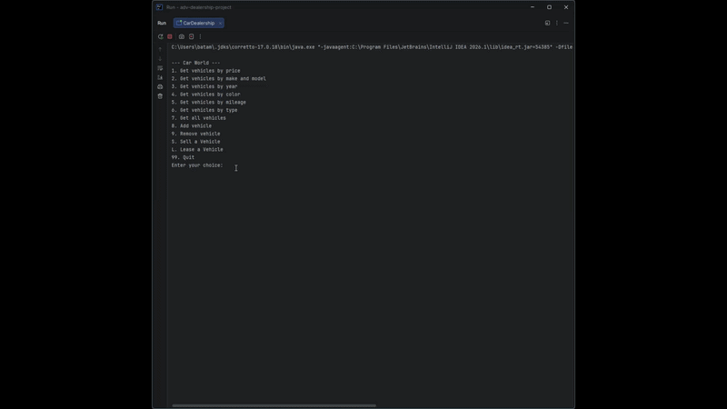

# Project Title

## Description of the Project

This application is made for car dealership staff to manage vehicle inventory and customer contracts. It allows employees to filter through their car inventory to find cars by price range,
make and model, year range, mileage, and vehicle type. It allows employees to create a contract to either sell or lease a vehicle which collects customer info and calculates fees and monthly 
payments automatically. The application saves that contract into a csv file.

## User Stories

- As a user, I want to be able to sell a vehicle, so I can have a record of it being a sale and not just the car being removed.
- As a user, I want to be able to lease a vehicle, so i can have a record of it being a lease and not just the car being removed.
- As a user, I want to save all sale and lease info into a file that persists, so I can keep track of vehicles being sold or leased.
- As a user, I want to be able to create contracts for selling and leasing vehicles, so I can show the customer all the needed info.
- As a user, I want to be able to save the contracts into a persistent file, so that I can have a record of all the vehicles sold and leased.
- As a user, I want to have a menu option to gather user info to create the contract, so I can get the right info to create the contract.

## Setup

Instructions on how to set up and run the project using IntelliJ IDEA.

### Prerequisites

- IntelliJ IDEA: Ensure you have IntelliJ IDEA installed, which you can download from [here](https://www.jetbrains.com/idea/download/).
- Java SDK: Make sure Java SDK is installed and configured in IntelliJ.

### Running the Application in IntelliJ

Follow these steps to get your application running within IntelliJ IDEA:

1. Open IntelliJ IDEA.
2. Select "Open" and navigate to the directory where you cloned or downloaded the project.
3. After the project opens, wait for IntelliJ to index the files and set up the project.
4. Find the main class with the `public static void main(String[] args)` method.
5. Right-click on the file and select 'Run 'YourMainClassName.main()'' to start the application.

## Technologies Used

- Java: JDK 17

## Demo

## Future Work

- Add a login menu
- Add the ability to add addons to a car
- Add an option to print the 10 most recent contracts

## Resources

- [Java Visual Learning Hub](https://raymaroun.github.io/yearup-java-visuals/index.html)
- [RayMaroun solution Repos](https://github.com/RayMaroun/yearup-spring-section-8-2026)
- [w3schools](https://www.w3schools.com/java/)

## Team Members

- **Bogdan Atamyeyev** - Lead developer.

## Thanks

Express gratitude towards those who provided help, guidance, or resources:

- Thank you to [Raymond Maroun] for continuous support and guidance.
- A special thanks to all my colleagues for their dedication and teamwork.
 